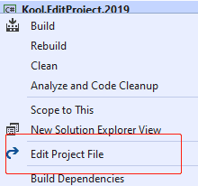
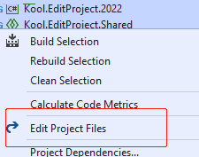

## About

master|dev
------|---
|

Edit Project is an open sourced Visual Studio extension to add the context menu for editing project file.

You can download it via Visual Studio 2015/2017 'Extensions and Updates' or from the [marketplace](https://marketplace.visualstudio.com/items?itemName=iheku.EditProject).

## Feature
- Add **Edit Project File** menu for non .NETCore projects.
 
    
- Add **Edit Selected Projects** menu for multiple selected projects.
	
	

## A known 'issue'
Because the **Edit Selected Projects** menu works for all kinds of projects,
include .NETCore projects which have the VS built-in Edit Project menu.
If you open a .NETCore project via this menu then open it via the VS built-in menu (or reverse), two edit windows will be opened.

## License
- [MIT](LICENSE)