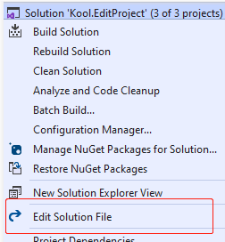

## About

 master (development)                                         | rel (release)                                                
 ------------------------------------------------------------ | ------------------------------------------------------------ 
  |  

An open source Visual Studio extension to add the context menu for editing project/solution file.

You can download it via Visual Studio 2015/2017/2019 'Extensions and Updates' or [Marketplace](https://marketplace.visualstudio.com/items?itemName=iheku.EditProject).

## Features
- Add **Edit Solution File** menu.

    
- Add **Edit Project File** menu for non .NETCore projects.

    
- Add **Edit Selected Projects** menu for multiple selected projects.
  
    
## A known 'issue'
Because the **Edit Selected Projects** menu works for all kinds of projects, include .NETCore projects which have the VS built-in Edit Project menu.
If you edit a .NETCore project via this menu then edit it via the VS built-in menu (vice versa), then two edit windows will be opened.

## License
- [MIT](LICENSE)