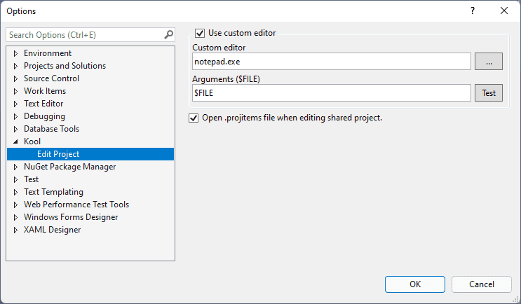

 

 

--------

An open source Visual Studio extension to add the context menu for editing project/solution file.

You can install it via Visual Studio 2015/2017/2019/2022 'Extensions' or download it from
- [Marketplace for VS2022](https://marketplace.visualstudio.com/items?itemName=heku.EditProject2022)
- [Marketplace for VS2019 and below](https://marketplace.visualstudio.com/items?itemName=heku.EditProject)

## Features

- Add **Edit Solution File** menu.

    

- Add **Edit Project File** menu for non .NETCore projects.

    

- Add **Edit Project Files** menu for multiple selected projects.
  
    

## Configurable

## A known 'issue'

Because the **Edit Project Files** menu works for all kinds of projects, include .NETCore projects which have the VS built-in Edit Project menu.
If you edit a .NETCore project via this menu then edit it via the VS built-in menu (vice versa), then two edit windows will be opened.

## Welcome

I'm not a native English speaker, so if you could correct any grammer mistake, it would be very appreciated.

## License

- [MIT](LICENSE)