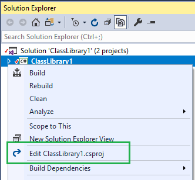

## About

Edit Project is an open sourced Visual Studio extension to add a context menu for editing project file.

You can download it via Visual Studio 2015/2017 'Extensions and Updates' or from the [marketplace](https://marketplace.visualstudio.com/items?itemName=iheku.EditProject).

## Features
- Add **Edit Project File** menu for non-.NETCore projects.
 
    

## License
- [MIT](LICENSE)
