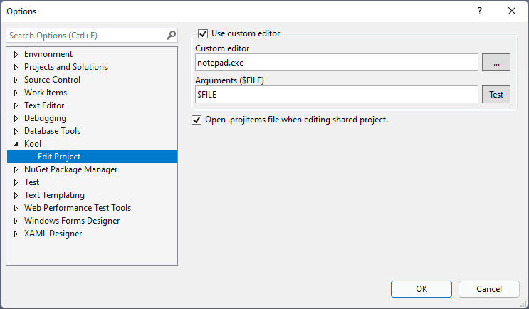

An open source Visual Studio extension to add the context menu for editing project/solution file.

## Features
- Add **Edit Solution File** menu.

    

- Add **Edit Project File** menu for non .NETCore projects.

    
    
- Add **Edit Project Files** menu for multiple selected projects.
  
    

## Configurable

## A known 'issue'

Because the **Edit Project Files** menu works for all kinds of projects, include .NETCore projects which have the VS built-in Edit Project menu.
If you edit a .NETCore project via this menu then edit it via the VS built-in menu (vice versa), then two edit windows will be opened.

## Feedback

If you have any question or problem, feel free to open an issue on [GitHub](https://github.com/heku/kool.editproject)